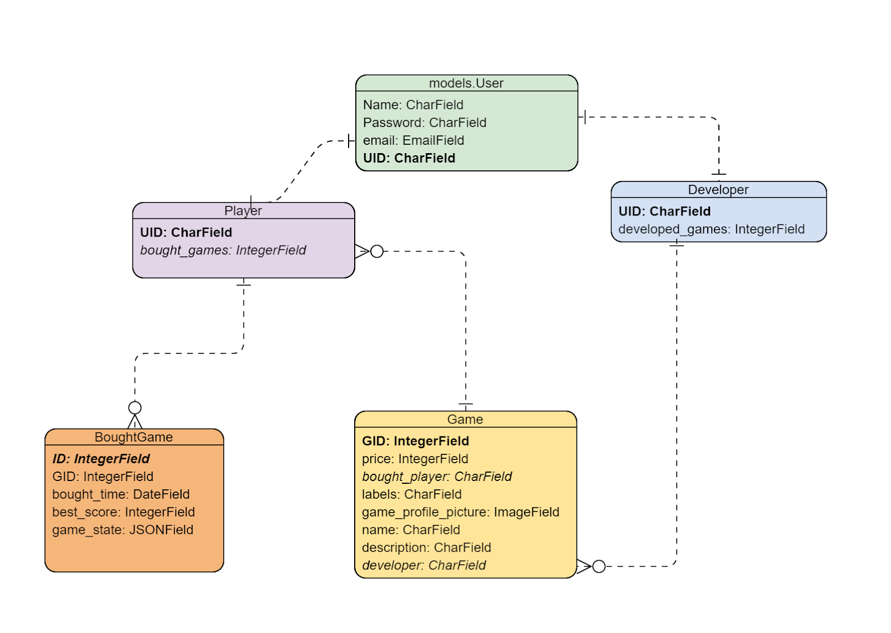

# 2333 Project Plan

Course Project for CS-C3170 Web Software Development

### Group Members

Hongkuan Wang  723316

Shiting Long  727778

Yuxi Xia  724797

### Design Overview

The online game store 2333 is an application that not only provides a platform for game developers to launch their games on but also supports game lovers to explore and play launched online games. In addition, game developers must set a price for their intellectual properties and thus the players can only play purchased games. Note that the application is a third-party service provider for building connections between developers and players, hence it does not concern matters associated with retailing prices of games or transaction details. Specifically, the store will redirect the user to the Simple Payment Service when transactions are needed.

### Features of the Application

#### 1. Registration and Authentication

The users of 2333 game store contain both players and developers. Note that a user cannot be both player and developer. Any user should log in before using services of 2333 and is able to log out. A user account can be created through registration, note the registration process needs to verify the email address provided by the user. For security reasons, a registered account detail cannot be used to register again. Visitors will not be granted access to services but can view the general website (game list and game display).

Here we plan to use Django auth for authentication. The credentials of a user to log in are username and password, which are default attributes of the User model in Django auth. The email attribute is essential to our application as well because we need to verify the email address before registration completed. If authentication fails, the visitor cannot access services of 2333.

#### 2. Developer Inventory

The developer inventory is a repository of a developer which contains information regarding the games that he/she develops launched in 2333, which essentially means that players have no access to any inventories. Note that the developer can only check the status of his/her own games. The status of a game includes sales statistics and other relative attributes (e.g. the retail price, labels, etc.). Here, sales statistics specify which users have bought the game together with when the users make the purchase as well as the number of sales.

This page basically shows the information stored in the database of a game and its corresponding developer. Hence, this feature should be enforced with subtle database design because there is sensitive information displayed on this page which other parties should not be able to access.

#### 3. Game List

The game list is an interface showing all launched games (name, description and profile picture) on 2333, which is also the index page of 2333 website. Any visitor, namely without authentication, should be able to view this page. There are labels section on this page to demonstrate the classifications of all the games. In this application, we use labels to categorize all the games. A game can have multiple labels and they are defined by its developer. Visitors can click buttons of labels to filter games.

The information displayed on this page is relatively limited and public so that the security risk here is relatively low. We focus more on the frontend design on this matter.

#### 4. Individual Game Display

This page corresponds to a launched game in 2333. The visitor will be redirected to this page when he/she click one game in the game list page. However,  only players have full access to this page, visitors without login will be redirected to log in page after a message “You need to log in to use the full service.” pops up if they click game playing screen - a zone on this page for game playing -, nevertheless, the visitors can see the information of the game. The player is able to play the game if he/she has purchased the game, otherwise an alert message “You need to purchase this game to continue.” pops up and the game playing screen would be blank. The user can purchase the game by clicking the Buy button on this page and will be redirected to the Simple Payment Service. If the game is purchased, the playing screen will show up and the user is also able to check the current highest score of this game. 

The game playing screen on this page is an iframe, the game will send messages to parent document informing the score change.  The communication is ensured by Window.postMessage and has six attribute message types: score, save, load request, load, error and settings. Details of the implementation, as well as further features of this page, are elaborated in below sections (see 5. and 10.).

#### 5. Player Functionalities

1) Buy games: a player is able to buy multiple games launched in 2333. This payment feature is supported by third-party online banking service -- the Simple Payment Service.

2) Play games: a player can only play the games that he/she has purchased. Namely, the application will check the purchase status of a player to his/her selected game. If the criterion is not met, the playing screen will not be shown and an alert message will show up (see 4.). Theoretically, the frontend will query the database on this matter and check the response of the database. 

3) Find games in the game list: players are able to find games in the game list page (see 3. for details).

4) Pause and resume an unfinished game: the player can pause and resume the game in individual game display page. This is explained in 10.

#### 6. Developer Functionalities

1) Add, remove, modify games in his/her own game inventory: the developer should have these basic operations to his/her game inventories. By modifying here it means the developer can change the name, description or profile picture of the developed games. This involves interactions with the frontend and the backend, which means the frontend calls the backend to send relative attributes of games and can also modify them.

2) Find sale statistics of each game in inventory: the developer should be able to see the sale statistics of his/her games (see 2.). This requires a foreign key in table Game that points to the bought games of table Player. The database needs to fetch all buyers of a certain game by reverse searching table Player.

#### 7. Third-party Login

The game store 2333 supports OpenID, Facebook and Google login. Here we plan to use Django OAuth Toolkit to implement this feature.

#### 8. Own Game

We plan to develop our own small javascript game. It is originally decided to be Snake (or some game like that). The player uses the keyboard to control left and right, the score of the player depends on the fruits or poison the snake eats.

#### 9. Social Media Sharing

The game store 2333 supports sharing the game introduction, namely the individual game display page link, to friends in Facebook, Twitter or Google. Note that if the page is opened by clicking the sharing link, the friend is automatically considered as a visitor of 2333. 

This feature should be implemented using APIs provided by these social media services.

#### 10. Save/Load and Resolution

The player can save the current game status in a game as well as load game by setting the previous game status, in other words, the player can pause and resume a game when playing. This should be implemented by storing the game status in bought games field in table Player. When the player hit the pause button, the game state will be recorded and written to the database. When the player hit the resume button, the game state of the game will be queried and will be sent to the game server in JSON format afterwards.

#### 11. RESTful API

The game store 2333 uses RESTful API to list games, there is no authentication needed regarding the matter according to 3.

#### 12. Mobile Friendly

The game store 2333 pays attention to usability on both desktops and mobile devices (smartphones/ tablets). Such a feature can be achieved using Bootstrap.

### Groupwork

Hongkuan Wang: Backend functionalities

Yuxi Xia: Frontend basic components, own game development

Shiting Long: Frontend features and UI, documentation, service design

We plan to use face-to-face discussion (Wechat video chat) as well as project management tool Trello. Most of the progress of the development can be seen from GitLab.

### Model design

The database model graph is demonstrated below:

### Timetable

12.21 starts project development

12.31 fulfils backend basic requirements

1.7 adds frontend support & and implements mandatory features

1.14 fulfils frontend requirements & deployment

1.21 adds extra features

1.28 finishes UI & first round testing

2.4 fixes bugs & more testing

2.11 fixes bugs & have a well-functioning application

2.19 submits the project
